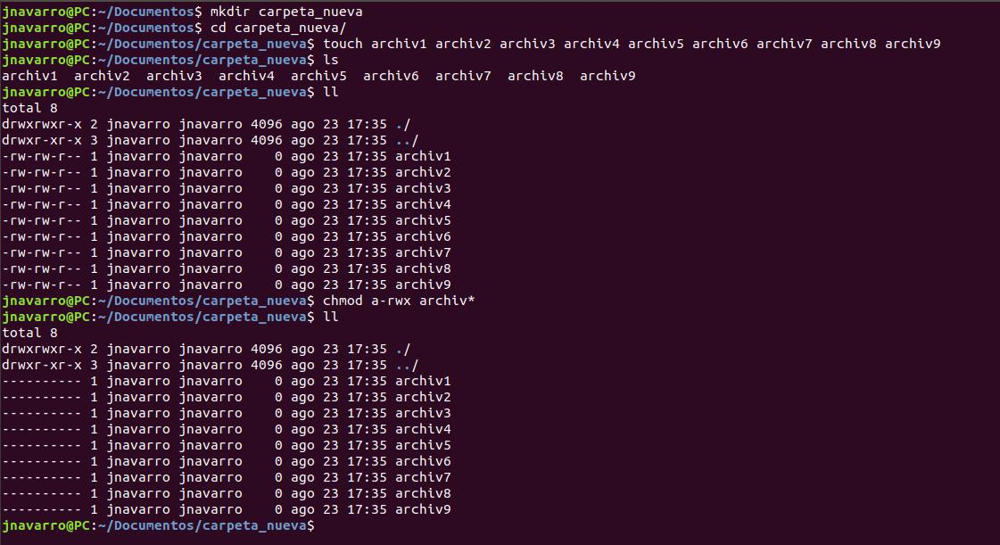
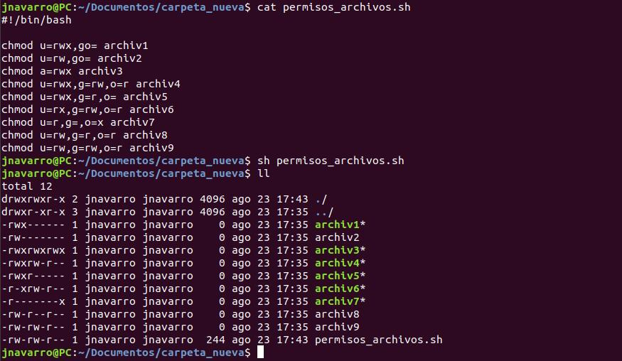
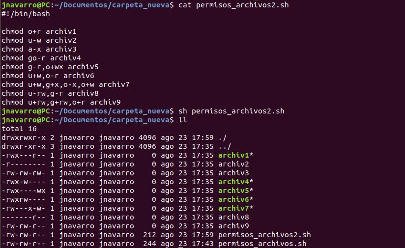

# Reto 2 - Linux - gestión de permisos

1. En un directorio vacío (nuevo), crear 9 archivos (archiv1, archiv2, etc.) utilizando el comando `touch`:

Solucion

---
 

2. Modifica los permisos usando el operador `=` del `chmod`, para que queden de la siguiente manera:

Solucion

---
 

3. Modificar los permisos de los archivos anteriores utilizando los operadores `+` y  `-` del `chmod` para que queden de la siguiente manera (Los cambios son relativos a los archivos del ejercicio anterior):

Solucion

---
 

4. **Problema propuesto** 

Roxs es la líder de un equipo de trabajo para una compañía que realiza Auditorías Externas. Él ha creado un archivo llamado *Lista_Precios* en su directorio `/home`. El archivo es altamente confidencial, pero resulta que existe un alto riesgo de que su archivo  sea  vulnerado  porque  otros  empleados  utilizan  su  equipo  al  finalizar  su turno.   Actualmente,   Roxs   posee   una   contraseña   segura,   pero   él   necesita resguardar los datos de ese archivo y no desea que nadie más que solamente él tenga acceso al mismo. ¿Qué solución le propondrían como equipo a Roxs? 

>1. Identificar las medidas de seguridad a implementarse. 
- Crear diferentes usuarios para que cada uno tenga su sesión
- Evitar que los usuarios puedan convertirse en usuario root
- Asignar los permisos correctos sobre el archivo llamado Lista_Precios

 
>2. Identificar el tipo de usuarios para quienes los permisos >serán cambiados.
- Asignaerle solo al usuario Roxs (dueño del archivo) los permisos rwx sobre ese archivo
 
>3. Identificar el tipo de permiso que necesita ser cambiado.
 chmod u=xwr,g=---,o=--- /home/roxs/Lista_precios
 
>4. Verificar los permisos de acceso al archivo.
- A continuación se puede observar como aplicando los pasos de los puntos anteriores se puede tener seguridad en el archivo Lista_precios
Solucion
#ls -la